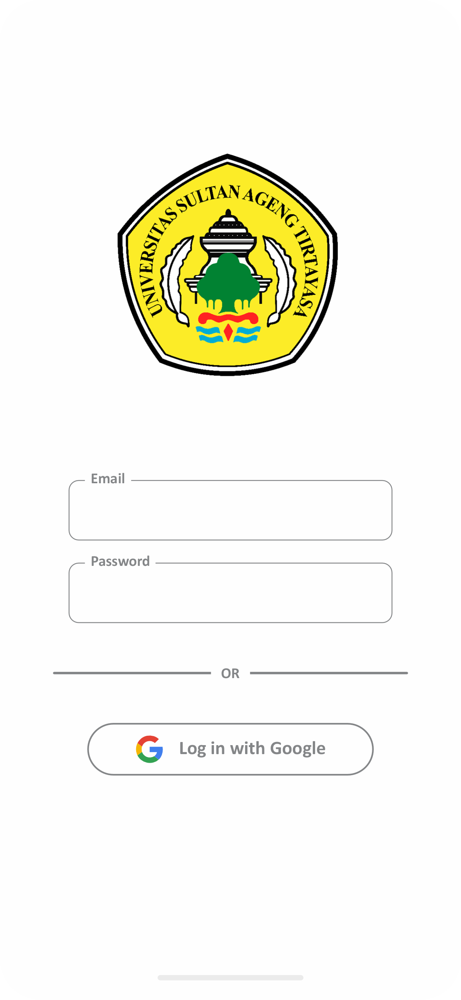
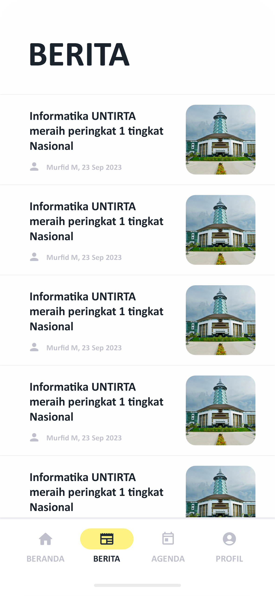
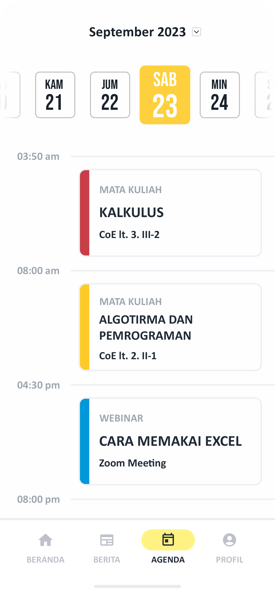
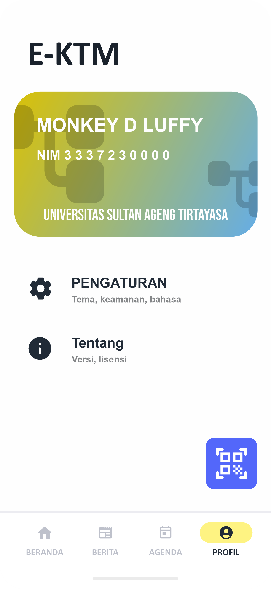
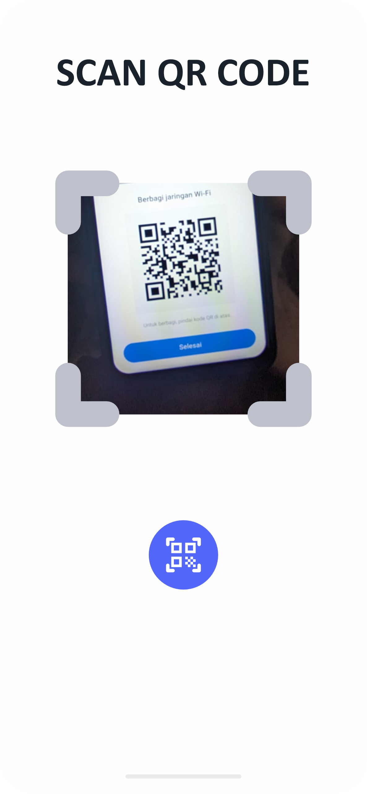

# MOBILE APP FT COMMUNITY WITH E-KTM
Mobile App FT Community with E-KTM adalah aplikasi mobile yang dibuat dan dikembangkan oleh Team PHP Informatika UNTIRTA. Aplikasi ini memiliki banyak fitur yang bisa digunakan oleh mahasiswa/i, fitur yang tersedia adalah fitur berita, agenda, dan juga E-KTM. Berikut adalah pejelasan mengenai aplikasi kami:

## Daftar Isi
- [Latar Belakang](#latar-belakang)
- [Tujuan](#tujuan)
- [Desain Aplikasi](#desain-ui-aplikasi)
- [Cara Kerja Aplikasi](#cara-kerja-aplikasi)
- [Algoritma Aplikasi](#algoritma-aplikasi)

## Latar Belakang
Dalam era teknologi informasi yang terus berkembang pesat, penggunaan aplikasi mobile dalam berbagai aspek kehidupan telah menjadi suatu kebutuhan yang tidak terhindarkan. Terutama di lingkungan pendidikan, aplikasi mobile telah membuka peluang baru untuk memberikan layanan yang lebih efisien, informatif, dan terhubung secara real-time kepada mahasiswa Universitas Sultan Ageng Tirtayasa.

## Tujuan
Kami membuat aplikasi ini tentunya memiliki tujuan untuk apa kami membuat aplikasi ini, berikut tujuan kami membuat aplikasi Mobile FT Community:
1. Memperluas fitur dari Kartu Tanda Mahasiswa
2. Memudahkan mahasiswa untuk menggunakan fasilitas Universitas seperti perpustakaan
3. Mempermudah Mahasiswa mencari informasi terkait jadwal perkuliahan
4. Meningkatkan keamanan identitas mahasiswa dengan fitur keamanan yang lebih canggih.
5. Mendorong mahasiswa untuk lebih terlibat dalam kegiatan kampus dengan memudahkan akses ke berbagai event dan program.
6. Merealisasikan system E-KTM dalam bentuk simulasi dan prototype baik perangkat lunak maupun perangkat keras.

## Desain UI Aplikasi
|  |  |
|:-------------------------:|:-------------------------:|
| Login Page                | Home Page                 |
|  |  |
| News Page                 |  Agenda Page              |
|  |  |
| Profile Page              | Scan Page                 |

## Cara Kerja Aplikasi
1. E-KTM (Kartu Tanda Mahasiswa Elektronik)
   - Pengguna membuka aplikasi
   - Pengguna login menggunakan akun yang sudah dibuatkan Universitas
   - Pengguna masuk ke tab fitur E-KTM
   - Pengguna dapat memanfaatkan fitur E-KTM untuk mengakses fasilitas kampus, peminjaman buku perpustakaan, dan tugas-tugas lain yang memerlukan identifikasi sebagai mahasiswa.
2. Agenda

## Algoritma Aplikasi
